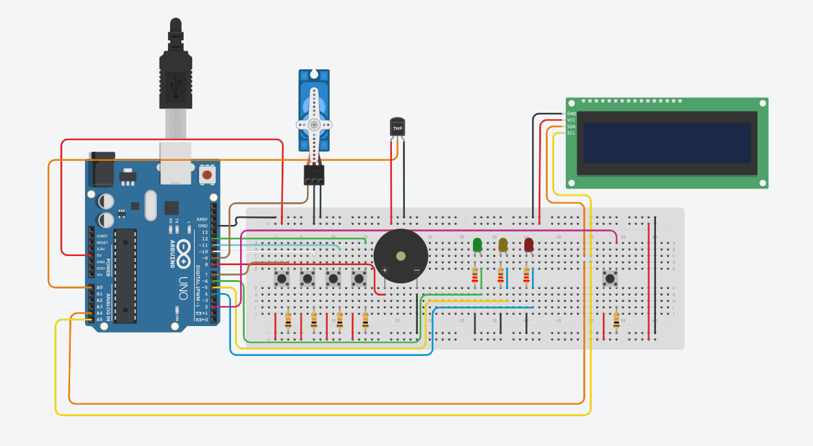

# 🔐 Locker Inteligente com Feedback Multissensorial

**Disciplina:** CCM520 – Internet das Coisas  
**Instituição:** Centro Universitário FEI  
**Componentes:** Arduino Uno, LCD I2C 16x2, Servomotor SG90, Buzzer, LEDs (3x), Sensor de Temperatura NTC, 5 Botões

---

## 📸 Circuito Montado



---

## 📋 Descrição do Projeto

Sistema de controle de acesso para um cofre inteligente baseado em Arduino Uno. O usuário digita uma senha de **3 dígitos** usando botões físicos; o LCD guia cada etapa, o servomotor representa a trava e um sensor de temperatura monitora o ambiente internamente ao cofre, disparando alerta caso a temperatura exceda 50 °C.

---

## 🔧 Hardware Utilizado

| Componente              | Quantidade | Pino Arduino       |
|-------------------------|------------|--------------------|
| Arduino Uno             | 1          | —                  |
| Display LCD 16x2 I2C    | 1          | SDA (A4), SCL (A5) |
| Servomotor SG90         | 1          | D9                 |
| Buzzer Ativo            | 1          | D8                 |
| LED Verde               | 1          | D6                 |
| LED Amarelo             | 1          | D5                 |
| LED Vermelho            | 1          | D4                 |
| Botão EMERGÊNCIA        | 1          | D2 (INT0)          |
| Botão UP (↑)            | 1          | D7                 |
| Botão OK (→)            | 1          | D10                |
| Botão DOWN (↓)          | 1          | D11                |
| Botão CONFIRMAR         | 1          | D12                |
| Sensor de Temperatura   | 1          | A0                 |
| Resistores 220Ω         | 3          | (um por LED)       |

> ⚠️ **Atenção:** As pinagens acima refletem o firmware atual (`locker.ino`). O botão de EMERGÊNCIA está conectado ao pino D2 (INT0) e usa interrupção de hardware via `attachInterrupt`.

---

## ⚙️ Funcionamento do Sistema

### Lógica de Senha

A senha é composta por **3 dígitos** (0–9). Os botões funcionam da seguinte forma:

| Botão          | Pino | Função                                                    |
|----------------|------|-----------------------------------------------------------|
| **UP ↑**       | D7   | Incrementa o dígito selecionado (0→1→...→9→0)            |
| **DOWN ↓**     | D11  | Decrementa o dígito selecionado (0→9→8→...→1→0)          |
| **OK →**       | D10  | Avança para o próximo dígito (posição 1→2→3)             |
| **CONF**       | D12  | Confirma a senha / tranca o cofre quando aberto           |
| **EMERGÊNCIA** | D2   | Interrupção de hardware – bloqueia o sistema instantaneamente |

O LCD exibe os dígitos em tempo real, destacando com `[n]` o dígito sendo editado:

```
Senha: [3] 7  1
UP/DW OK CONF
```

### Senha Padrão

```
3 - 7 - 1
```

Para alterar, edite o array no início do código:

```cpp
const int SENHA_CORRETA[3] = {3, 7, 1};
```

---

## 🔄 Máquina de Estados Finita (FSM)

O sistema é gerenciado por uma FSM com **5 estados**:

```
┌─────────────┐    Botão OK         ┌──────────────────┐
│   TRANCADO  │ ──────────────────► │  INSERINDO_SENHA │
│ (estado ini)│                     │ (edição de senha)│
└─────────────┘                     └──────────────────┘
       ▲                               │             │
       │ CONF: trancar                 │ CONF correto│ CONF errado
       │ (servo 0°)                    ▼             ▼ 3 erros
       │                         ┌─────────┐   ┌──────────┐
       │◄────────────────────────│  ABERTO │   │BLOQUEADO │
       │      timeout 15s        │servo 90°│   │espera 15s│
       │                         └─────────┘   └──────────┘
       │
       │◄────── Emergência (INT0, D2) ─────────────────────
       │
   ┌───────────────┐
   │  ALERTA_TEMP  │ (sensor NTC > 50°C)
   │ buzzer + LCD  │
   └───────────────┘
```

### Descrição dos Estados

| Estado          | Servo | LED Ativo | Condição de saída                          |
|-----------------|---------|-----------|--------------------------------------------|
| TRANCADO        | 0°    | —         | Botão OK → INSERINDO                       |
| INSERINDO_SENHA | 0°    | Amarelo   | CONF correto → ABERTO; 3 erros → BLOQUEADO |
| ABERTO          | 90°   | Verde     | CONF → TRANCADO                            |
| BLOQUEADO       | 0°    | Vermelho  | Timeout 15s → TRANCADO                     |
| ALERTA_TEMP     | —     | Vermelho  | Temperatura normaliza                      |

---

## 🚨 Funcionalidades de Segurança

- **Bloqueio após 3 tentativas erradas:** sistema trava por **15 segundos**, LED vermelho pisca, contagem regressiva exibida no LCD.
- **Monitoramento de temperatura:** sensor NTC no pino A0 detecta temperatura acima de **50 °C** dentro do cofre. Se ativado, dispara alarme sonoro e visual independentemente do estado atual.
- **Interrupção de emergência (INT0):** o botão EMERGÊNCIA no pino D2 usa `attachInterrupt` para bloquear o sistema instantaneamente a partir de qualquer estado, redirecionando para BLOQUEADO.

---

## 📦 Bibliotecas Necessárias

Instalar pelo **Library Manager** da Arduino IDE:

- `LiquidCrystal_I2C` (Frank de Brabander)
- `Servo` (já inclusa na IDE)

---

## 🔌 Diagrama de Conexão

```
Arduino Uno
│
├─ D2  ── Botão EMERGÊNCIA (INT0 – interrupção de hardware)
├─ D4  ── Resistor 220Ω ── LED Vermelho ── GND
├─ D5  ── Resistor 220Ω ── LED Amarelo  ── GND
├─ D6  ── Resistor 220Ω ── LED Verde    ── GND
├─ D7  ── Botão UP ↑
├─ D8  ── Buzzer (+) / GND ao negativo
├─ D9  ── Servo (sinal laranja)
├─ D10 ── Botão OK →
├─ D11 ── Botão DOWN ↓
├─ D12 ── Botão CONFIRMAR
├─ A0  ── Sensor de Temperatura NTC
├─ A4 (SDA) ── LCD I2C SDA
└─ A5 (SCL) ── LCD I2C SCL
```

> O endereço padrão do LCD I2C é `0x27`. Se não funcionar, tente `0x3F`.

---

## 🛠️ Como Reproduzir

1. Monte o circuito conforme o diagrama acima no protoboard.
2. Instale as bibliotecas necessárias na Arduino IDE.
3. Abra `locker.ino` e, se necessário, ajuste o endereço I2C do LCD (linha `LiquidCrystal_I2C lcd(0x27, 16, 2)`).
4. Faça o upload para o Arduino Uno.
5. Senha padrão: **3 – 7 – 1**

---

## 🗂️ Estrutura do Repositório

```
/
├── locker.ino    # Firmware principal (FSM + lógica completa)
├── print.png     # Foto do circuito montado
└── README.md     # Esta documentação
```
